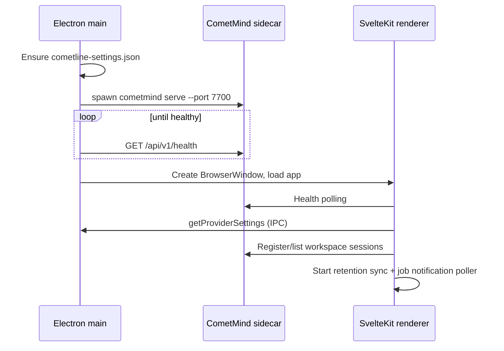
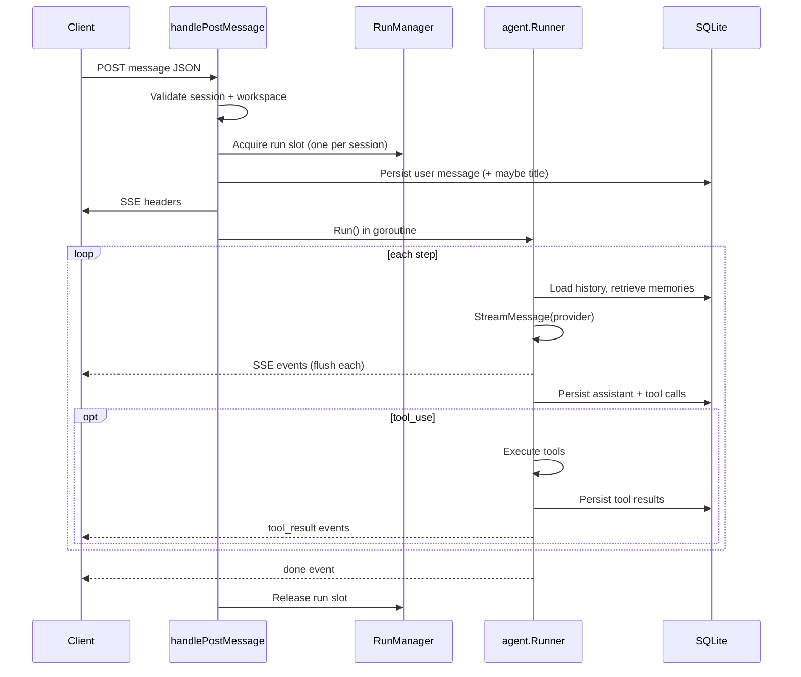

# 03 — Data Flows

> **Prerequisite:** [02-architecture.md](./02-architecture.md)  
> **Next:** [04-comet-sdk.md](./04-comet-sdk.md)

This doc traces the major execution flows GitNexus indexes. Each flow lists the steps, key symbols, and source files.

---

## Flow 1: Desktop startup

What happens when you launch Cometline.



| Step                   | Source                                                                        |
| ---------------------- | ----------------------------------------------------------------------------- |
| Port/health constants  | `cometline/electron/src/domains/cometmind-lifecycle.ts`                       |
| Resolve sidecar binary | `cometline/electron/src/domains/runtime.ts`                                   |
| Spawn sidecar          | `cometmind serve --port … --watch-parent` in `domains/cometmind-lifecycle.ts` |
| Health polling (main)  | `cometline/electron/src/domains/cometmind-lifecycle.ts`                       |
| Renderer boot          | `cometline/src/routes/+layout.svelte`                                         |
| Runtime health store   | `cometline/src/lib/stores/runtime.svelte.ts`                                  |

**Invariant:** Sidecar stop waits for process exit before restart so port 7700 and the SQLite WAL lock are released.

---

## Flow 2: First message from home screen

Creating a new session and sending the first message.

```text
User submits hero composer (+page.svelte)
  → createSession(workspace_path, model_id, provider_id)
  → sessionStore queues pending first message
  → navigate to /session/{id}
  → ChatView mounts (keyed by sessionId)
  → consumes pending message from queue
  → startChat() coordinates first-turn animation
  → chatStore.send() → POST /sessions/{id}/messages
  → SSE events → reducer → live bubbles
  → session title refresh after turn
```

| Step                        | Source                                           |
| --------------------------- | ------------------------------------------------ |
| Home route create + queue   | `cometline/src/routes/+page.svelte`              |
| Session route keys ChatView | `cometline/src/routes/session/[id]/+page.svelte` |
| Pending message consumption | `cometline/src/lib/components/ChatView.svelte`   |
| Turn queue                  | `ChatView.svelte` + `createChatTurnQueue`        |
| Streaming loop              | `cometline/src/lib/stores/chat.svelte.ts`        |
| SSE client                  | `cometline/src/lib/client/cometmind.ts`          |
| Reducer                     | `cometline/src/lib/reducers/chat.ts`             |

**Why the pending-message queue exists:** Without it, navigation to `/session/{id}` races with transcript load — the first user bubble can disappear or duplicate.

---

## Flow 3: CometMind HTTP turn execution

What the server does when it receives `POST /api/v1/sessions/{id}/messages`.



| Step               | Source                                                |
| ------------------ | ----------------------------------------------------- |
| Route registration | `cometmind/server/server.go`                          |
| Message handler    | `cometmind/server/messages.go` — `handlePostMessage`  |
| Single-run lock    | `cometmind/server/run_manager.go`                     |
| Runner factory     | `cometmind/internal/runtime/runtime.go` → `RunnerFor` |

GitNexus process `proc_78_appendusermessageand` traces user message persistence through `Service.AppendUserMessageContent` in `session/service.go`.

---

## Flow 4: Agent step and tool loop

The core brain — `Runner.Run` in `cometmind/internal/agent/runner.go`.

```text
Run(ctx, userTurn, eventCh)
  defer emit done

  for step := 0; step < MaxSteps; step++ {
    1. BuildSDKMessages from SQLite rows
    2. NormalizeHistoryForProvider
    3. Retrieve memories → emit turn_status + inject into system prompt
    4. Compact context if needed
    5. BuildRequest(tools, system, messages, skills index)
    5. StreamMessage(provider, request)
       → drain Events(), translate each to CometMind event
       → forward turn_status, text_delta, reasoning_*, tool_call, step_finish
    6. Persist assistant text, reasoning blocks, tool-call shells
    7. Save token usage
    8. if finish_reason == stop || max_tokens || no tool calls → break
    9. For each tool call:
         → registry.Execute(name, input)
         → persist tool result message
         → emit tool_result
    10. Append tool results to history → next step
  }

  Post-turn: extract memories (async)
```

**Outgoing calls from `Runner.Run` (GitNexus):**

- `llm.StreamMessage` — provider streaming
- `event.TextDelta`, `ReasoningStart`, `ReasoningDelta`, `ToolCall`, `ToolResult`, `StepFinish` — SSE emission
- `BuildRequest`, `NormalizeHistoryForProvider` — request assembly
- `TurnStore` methods — persistence (via interface, not concrete DB)

**Finish reasons** are normalized in comet-sdk (`stop`, `tool_use`, `max_tokens`, `error`) so the runner never branches on provider-specific strings.

---

## Flow 5: SDK streaming pipeline

How `StreamMessage` bridges provider wire format to agent events.

```text
Runner.Run
  → llm.StreamMessage(ctx, provider, req)
    → provider.Stream(ctx, req)
      → HTTP POST to provider endpoint
      → internal/sse scanner reads frames
      → provider/convert.go maps wire → cometsdk.Event
    → MessageStream.run forwards events + accumulates final message
  → Runner drains Events(), calls Result() after channel closes
```

| Symbol            | File                                               |
| ----------------- | -------------------------------------------------- |
| `StreamMessage`   | `comet-sdk/llm/stream.go`                          |
| `Provider.Stream` | `comet-sdk/provider/{anthropic,openai,codex,xai}/` |
| SSE scanner       | `comet-sdk/internal/sse/scanner.go`                |
| Retry             | `comet-sdk/internal/retry/retry.go`                |

**Critical invariant:** Callers must drain `Events()` before `Result()` — otherwise deadlock.

---

## Flow 6: Renderer SSE → UI state

How stream events become chat bubbles.

```text
chatStore.send()
  → streamMessage() in cometmind.ts (async generator)
  → for each parsed StreamEvent:
       applyEventToSession()
         → reduceChatState() or reduceChatStateDelta()
         → returns new ChatItem[] (immutable)
  → Svelte reactivity picks up new references
  → ChatThread renders rows
```

Key symbols (line numbers drift — search by name):

- `applyEventToSession` in `chat.svelte.ts`
- `reduceChatState` / `reduceChatStateDelta` in `reducers/chat.ts`

**Reducer rules:**

| Rule                                                     | Why                                            |
| -------------------------------------------------------- | ---------------------------------------------- |
| Clone inputs, return new state                           | Svelte 5 needs new references for live updates |
| Match tool rows by tool ID                               | Pair call with result                          |
| Attach reasoning to assistant bubble                     | Single visual block                            |
| Auth errors → settings hints                             | Actionable user message                        |
| `step_finish` settles pending without clearing assistant | Multi-step continuity                          |
| `turn_recover` restores partial stream state             | Survives mid-turn failures                     |

Session chat SSE is separate from the **runtime event stream** (`GET /api/v1/events`) used for memory toasts / compaction feedback — see Flow 7b.

---

## Flow 7: Settings save and runtime apply

```text
SettingsPanel Save
  → settings panel controller syncs draft fields
  → settingsStore.save() / persistSettings() (renderer)
  → optional PUT /api/v1/memories/settings or /jobs/settings
  → electronAPI.saveProviderSettings (IPC)
  → Electron normalizes full settings blob
  → split write: cometline-settings.json + cometline-desktop.json
  → applies native side effects (shortcuts, login item, icon)
  → classify via settingsapply:
       reload → Runtime.Reload (most runtime changes)
       gateway → recycle Discord gateway only
       restart → full serve restart (mainly host/port)
  → renderer reconnects only when a full restart was requested
```

Almost all runtime settings (providers, memory, MCP, ACP/harness, storage cleanup, jobs reconcile, autonomy) use **in-place reload**. Gateway token/env recycles the gateway process only. Full sidecar restart remains for process bind changes such as host/port. See [../SETTINGS_AND_PERSISTENCE.md](../SETTINGS_AND_PERSISTENCE.md).

GitNexus processes `proc_53_save` through `proc_55_save` trace settings normalization via `normalizeCometMindSettings` in `settings/schema.ts`.

---

## Flow 7b: Runtime SSE → memory toasts

```text
+layout.svelte boots
  → startRuntimeEventStream() → GET /api/v1/events
  → memory_updated / memory_compaction_completed frames
  → memory-toasts.svelte.ts shows non-chat UI feedback
```

Chat-turn SSE (`POST …/messages`) still carries `memory_injected` / `memory_updated` for in-transcript cues; compaction completion is often surfaced through this runtime stream rather than chat rows.

---

## Flow 8: Semantic memory

```text
Before turn:
  memory.Service.RetrieveForTurn
    → retriever.retrieve (embedding search)
    → inject top-k memories into system prompt

After turn:
  memory extractor analyzes conversation
  → persist new memory entries with embeddings
```

GitNexus process `proc_198_search` traces `Service.Search` → `retriever.search` → `retriever.retrieve` in `internal/memory/`.

Memories are **workspace-scoped**. Manage them in Settings → Memory.

---

## Flow 9: MCP tool integration

```text
Settings → CometMind → MCP (saved to cometline-settings.json)
  → sidecar start or Runtime.Reload → mcp.Manager connects/refreshes enabled servers
  → stdio / HTTP / SSE transports via go-sdk
  → tools merged into registry as mcp_{serverId}_{toolName}
  → agent loop executes via same tool_call / tool_result path

OAuth remote servers:
  POST /api/v1/mcp/servers/{id}/oauth-flows
    → metadata discovery (RFC 9728, 8414)
    → dynamic client registration (RFC 7591)
    → Authorization Code + PKCE
    → tokens at ~/.cometmind/mcp-oauth/{serverId}.json
    → headless refresh at connect time
```

GitNexus traces `StartOAuth` through `oauth_flow.go` and `oauth_login.go`; runtime connect via `connectServer` in `mcp/client.go`.

---

## Flow 10: Coding-harness delegation

```text
Model calls delegate_coding_task tool (only if acp.enabled + harness binary available)
  → DelegateCodingTask.Execute
  → spawn fixed CLI profile for selected harness (opencode / claude / codex)
  → stream harness progress
  → emit subagent_started / subagent_progress / subagent_finished SSE events
  → Cometline renders subagent chat rows/panels
  → result returns to agent loop as tool_result
```

Configure in Settings → CometMind → **Coding task delegation** (`default_harness` only; CLI args are not user-editable). Tool: `cometmind/internal/tools/delegatecoding.go`. Runner: `cometmind/internal/acp/runner.go`.

---

## Flow 11: Jobs and scheduled jobs

```text
User/agent/Discord creates job
  → POST /api/v1/jobs
  → jobs.Service persists todo job + job_event
  → user or autonomous worker claims lease
  → worker heartbeats progress and records events
  → complete, release, block, archive, or delete job

Scheduled job:
  → POST /api/v1/scheduled-jobs with run_at or cron_expr
  → scheduler.MaterializeDue creates normal jobs
  → normal job lease/completion path handles execution
```

Cometline renders `/jobs` and polls for optional desktop notifications. Discord can propose jobs and send job updates through the gateway.

---

## Flow 12: Discord gateway

```text
Discord message arrives
  → gateway/discord adapter
  → Router.HandleInbound
  → Runner.RunTurn (same agent loop)
  → stream response back to Discord channel/thread
```

Per-thread sessions map to CometMind sessions. Start with:

```bash
cometmind gateway run --platform discord
```

GitNexus links `Router.HandleInbound` → `Runner` interface in `gateway/router.go`.

---

## Flow 13: Packaging

```text
make package
  → build cometmind → cometmind/dist/cometmind
  → pnpm build → cometline/build (static SvelteKit)
  → electron-builder packages renderer + sidecar extraResource
  → production app serves via app://bundle protocol
```

Sidecar is bundled as an `extraResource`, not inside the asar archive.

---

## Flow 14: External workspace change → safe preview refresh

```text
Filesystem/Git change under active workspace
  → Electron workspace watcher coalesces paths (300 ms)
  → preload emits `workspace-changed`
  → root layout updates workspace refresh state
  → tree, Git, mentions, and preview surfaces re-fetch as appropriate
  → a clean preview reloads; a dirty editor retains its draft and can show a full-page diff
```

The watcher deliberately skips noisy dependency/build directories and treats `.git` changes as a Git refresh signal. It is a UI-refresh hint, not a second file-sync engine.

---

## What's next

Now that you understand _how data moves_, dive into each module:

- [04-comet-sdk.md](./04-comet-sdk.md) — LLM adapter layer
- [05-cometmind-runtime.md](./05-cometmind-runtime.md) — agent brain and persistence
