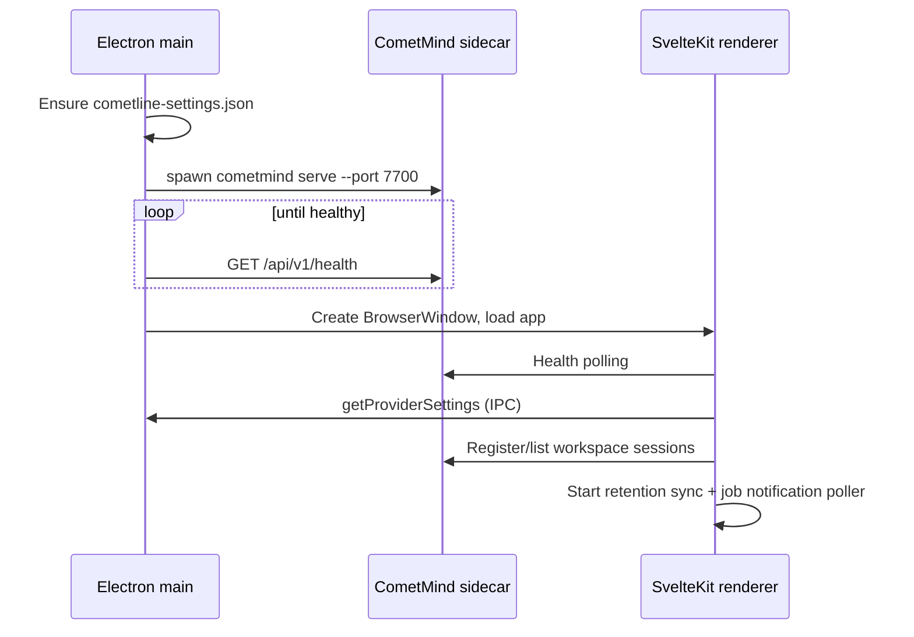
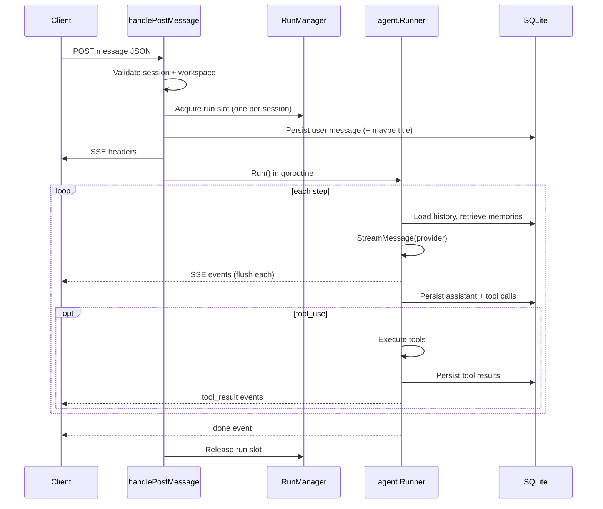

# 03 - Data Flows

> **Prerequisite:** [02-architecture.md](./02-architecture.md)  
> **Next:** [04-comet-sdk.md](./04-comet-sdk.md)

Prerequisite means read that page first.

This page follows the main execution flows that GitNexus indexes. An **execution flow** is the ordered steps for one job. GitNexus is the code index for this project. Each flow lists the steps, the key symbols, and the source files. A **symbol** is a function or type name in the code.

---

## Flow 1: Desktop startup

What happens when you launch Cometline.



In the diagram, spawn means start a process. A **sidecar** is a helper process. The desktop app starts it and stops it. The **renderer** is the window that shows the UI. **IPC** is a message between that window and the Electron main process. A **poller** repeats a check on a timer.

| Step                   | Source                                                                        |
| ---------------------- | ----------------------------------------------------------------------------- |
| Port/health constants  | `cometline/electron/src/domains/cometmind-lifecycle.ts`                       |
| Resolve sidecar binary | `cometline/electron/src/domains/runtime.ts`                                   |
| Spawn sidecar          | `cometmind serve --port … --watch-parent` in `domains/cometmind-lifecycle.ts` |
| Health polling (main)  | `cometline/electron/src/domains/cometmind-lifecycle.ts`                       |
| Renderer boot          | `cometline/src/routes/+layout.svelte`                                         |
| Runtime health store   | `cometline/src/lib/stores/runtime.svelte.ts`                                  |

**Invariant:** An **invariant** is a rule that must stay true. Sidecar stop waits for process exit before a restart. That wait releases port 7700. It also releases the SQLite WAL lock. **WAL** means write-ahead log. SQLite holds that lock while the database is open.

---

## Flow 2: First message from home screen

Creating a new session and sending the first message. The **hero composer** is the message box on the home screen.

```text
User submits hero composer (+page.svelte)
  → createSession(workspace_path, model_id, provider_id)
  → sessionStore queues pending first message
  → navigate to /session/{id}
  → ChatView mounts (keyed by sessionId)
  → consumes pending message from queue
  → startChat() coordinates first-turn animation
  → chatStore.send() → POST /sessions/{id}/messages
  → SSE events → reducer → live bubbles
  → session title refresh after turn
```

| Step                        | Source                                           |
| --------------------------- | ------------------------------------------------ |
| Home route create + queue   | `cometline/src/routes/+page.svelte`              |
| Session route keys ChatView | `cometline/src/routes/session/[id]/+page.svelte` |
| Pending message consumption | `cometline/src/lib/components/ChatView.svelte`   |
| Turn queue                  | `ChatView.svelte` + `createChatTurnQueue`        |
| Streaming loop              | `cometline/src/lib/stores/chat.svelte.ts`        |
| SSE client                  | `cometline/src/lib/client/cometmind.ts`          |
| Reducer                     | `cometline/src/lib/reducers/chat.ts`             |

**Why the pending-message queue exists:** Without it, opening `/session/{id}` overlaps transcript load. A **transcript** is the saved chat text. The first user bubble can then disappear. It can also appear twice. A **bubble** is one message box on the screen.

**SSE** means server-sent events. The server pushes those events over one open HTTP response. A **reducer** turns the events into UI state.

---

## Flow 3: CometMind HTTP turn execution

What the server does when it receives `POST /api/v1/sessions/{id}/messages`. A **turn** is one user message plus the work to answer it.



A **goroutine** is a Go task that runs in the background. **Flush** means send each event at once, not later. In the diagram, opt means that step is optional. A **run slot** allows one active turn for that session.

| Step               | Source                                                |
| ------------------ | ----------------------------------------------------- |
| Route registration | `cometmind/server/server.go`                          |
| Message handler    | `cometmind/server/messages.go`: `handlePostMessage`   |
| Single-run lock    | `cometmind/server/run_manager.go`                     |
| Runner factory     | `cometmind/internal/runtime/runtime.go` → `RunnerFor` |

GitNexus process `proc_78_appendusermessageand` follows user message persistence. **Persistence** means the app saves the data. The path goes through `Service.AppendUserMessageContent` in `session/service.go`.

---

## Flow 4: Agent step and tool loop

This is the main loop of the agent. The function is `Runner.Run` in `cometmind/internal/agent/runner.go`.

```text
Run(ctx, userTurn, eventCh)
  defer emit done

  for step := 0; step < MaxSteps; step++ {
    1. BuildSDKMessages from SQLite rows
    2. NormalizeHistoryForProvider
    3. Retrieve memories → emit turn_status + inject into system prompt
    4. Compact context if needed
    5. BuildRequest(tools, system, messages, skills index)
       step limit = min(this model's output limit, 32,000)
    5. StreamMessage(provider, request)
       → drain Events(), translate each to CometMind event
       → forward turn_status, text_delta, reasoning_*, tool_call, step_finish
    6. Persist assistant text, reasoning blocks, tool-call shells
    7. Save token usage
    8. if finish_reason == stop or there are no tool calls → stop
       if finish_reason == max_tokens → continue a few times, then stop
    9. For each tool call:
         → registry.Execute(name, input)
         → persist tool result message
         → emit tool_result
    10. Append tool results to history → next step
  }

  Post-turn: extract memories (async)
```

In that loop, compact context means shorten older chat if needed. Async means memory extraction after the turn runs in the background.

**Outgoing calls from `Runner.Run` (GitNexus):**

**Outgoing** means these calls leave `Runner.Run`.

- `llm.StreamMessage`: provider streaming
- `event.TextDelta`, `ReasoningStart`, `ReasoningDelta`, `ToolCall`, `ToolResult`, `StepFinish`: SSE emission
- `BuildRequest`, `NormalizeHistoryForProvider`: request assembly
- `TurnStore` methods: persistence through an interface, not the concrete database

**Concrete** means the real database type, not only the interface. An **interface** is a list of methods, not the real database. SSE emission means those calls send server-sent events.

**Finish reasons** are normalized in comet-sdk (`stop`, `tool_use`, `max_tokens`, `error`). **Normalized** means every provider uses those same words. The runner does not look at provider-specific strings.

`max_tokens` means the step reached the output limit. The limit is the smaller of the current model's output limit and 32,000 tokens. A **token** is a small piece of text that the model counts. On `max_tokens`, the runner can continue a few times, then stop. See [05a-output-limit.md](./05a-output-limit.md). Thinking tokens and answer tokens share that limit on current models. Thinking tokens are the model's reasoning. Answer tokens are the reply text.

---

## Flow 5: SDK streaming pipeline

How `StreamMessage` turns provider wire format into agent events. **Wire format** is the raw data shape from the provider.

```text
Runner.Run
  → llm.StreamMessage(ctx, provider, req)
    → provider.Stream(ctx, req)
      → HTTP POST to provider endpoint
      → internal/sse scanner reads frames
      → provider/convert.go maps wire → cometsdk.Event
    → MessageStream.run forwards events + accumulates final message
  → Runner drains Events(), calls Result() after channel closes
```

| Symbol            | File                                               |
| ----------------- | -------------------------------------------------- |
| `StreamMessage`   | `comet-sdk/llm/stream.go`                          |
| `Provider.Stream` | `comet-sdk/provider/{anthropic,openai,codex,xai}/` |
| SSE scanner       | `comet-sdk/internal/sse/scanner.go`                |
| Retry             | `comet-sdk/internal/retry/retry.go`                |

**Critical invariant:** Callers must drain `Events()` before `Result()`. **Drain** means read every event until the channel closes. If you do not, the call deadlocks. A **deadlock** means both sides wait, and neither one finishes.

---

## Flow 6: Renderer SSE → UI state

How stream events become chat bubbles. In the flow below, immutable means the old list is not changed.

```text
chatStore.send()
  → streamMessage() in cometmind.ts (async generator)
  → for each parsed StreamEvent:
       applyEventToSession()
         → reduceChatState() or reduceChatStateDelta()
         → returns new ChatItem[] (immutable)
  → Svelte reactivity picks up new references
  → ChatThread renders rows
```

Key symbols (line numbers change, so search by name):

- `applyEventToSession` in `chat.svelte.ts`
- `reduceChatState` / `reduceChatStateDelta` in `reducers/chat.ts`

**Reducer rules:**

| Rule                                                     | Why                                            |
| -------------------------------------------------------- | ---------------------------------------------- |
| Clone inputs, return new state                           | Svelte 5 needs new references for live updates |
| Match tool rows by tool ID                               | Pair call with result                          |
| Attach reasoning to assistant bubble                     | Single visual block                            |
| Auth errors → settings hints                             | Actionable user message                        |
| `step_finish` settles pending without clearing assistant | Multi-step continuity                          |
| `turn_recover` restores partial stream state             | Survives mid-turn failures                     |

A **reference** is the object the UI holds. Svelte 5 updates the screen when that object is new. **Actionable** means the user can act on the message. **Continuity** means the assistant text stays across steps. **Survives** means the partial text is kept after a failure in the middle of the turn.

Session chat SSE is separate from the **runtime event stream** (`GET /api/v1/events`). That stream is used for memory toasts and compaction feedback. A **toast** is a short notice on screen. **Compaction** means making stored memory shorter. See Flow 7b.

---

## Flow 7: Settings save and runtime apply

```text
SettingsPanel Save
  → settings panel controller syncs draft fields
  → settingsStore.save() / persistSettings() (renderer)
  → optional PUT /api/v1/memories/settings or /jobs/settings
  → electronAPI.saveProviderSettings (IPC)
  → Electron normalizes full settings blob
  → split write: cometline-settings.json + cometline-desktop.json
  → applies native side effects (shortcuts, login item, icon)
  → classify via settingsapply:
       reload → Runtime.Reload (most runtime changes)
       gateway → recycle Discord gateway only
       restart → full serve restart (mainly host/port)
  → renderer reconnects only when a full restart was requested
```

Almost all runtime settings use **in-place reload**. **In place** means the running process loads the new settings and does not exit. This covers providers, memory, MCP, ACP/harness, storage cleanup, jobs reconcile, and autonomy.

A **harness** is an outside coding program. Flow 10 names OpenCode, Claude, and Codex. **Reconcile** means check saved jobs and bring their records back into agreement. **Autonomy** means jobs can start with no new user message.

A gateway token or env change recycles the gateway process only. **Recycle** means stop that one process and start it again. A full sidecar restart remains for process bind changes, such as host or port. **Bind** means the address and port the server listens on. See [../SETTINGS_AND_PERSISTENCE.md](../SETTINGS_AND_PERSISTENCE.md).

GitNexus processes `proc_53_save` through `proc_55_save` follow settings normalization. **Normalization** means the app rewrites settings into one standard shape. The function is `normalizeCometMindSettings` in `settings/schema.ts`.

---

## Flow 7b: Runtime SSE → memory toasts

```text
+layout.svelte boots
  → startRuntimeEventStream() → GET /api/v1/events
  → memory_updated / memory_compaction_completed frames
  → memory-toasts.svelte.ts shows non-chat UI feedback
```

Chat-turn SSE (`POST …/messages`) still carries `memory_injected` and `memory_updated`. Those events are cues inside the transcript. A **cue** is a small signal in the chat. Compaction completion is often shown on this runtime stream, not in chat rows.

---

## Flow 8: Semantic memory

**Semantic** memory stores facts by meaning, not only by exact words.

```text
Before turn:
  memory.Service.RetrieveForTurn
    → retriever.retrieve (embedding search)
    → inject top-k memories into system prompt

After turn:
  memory extractor analyzes conversation
  → persist new memory entries with embeddings
```

An **embedding** is a list of numbers that stands for text. **Top-k** means the best matches, up to a count of k.

GitNexus process `proc_198_search` follows `Service.Search` → `retriever.search` → `retriever.retrieve` in `internal/memory/`.

Memories are **workspace-scoped**. That means each workspace has its own memories. A **workspace** is one project folder. Manage them in Settings → Memory.

---

## Flow 9: MCP tool integration

```text
Settings → CometMind → MCP (saved to cometline-settings.json)
  → sidecar start or Runtime.Reload → mcp.Manager connects/refreshes enabled servers
  → stdio / HTTP / SSE transports via go-sdk
  → tools merged into registry as mcp_{serverId}_{toolName}
  → agent loop executes via same tool_call / tool_result path

OAuth remote servers:
  POST /api/v1/mcp/servers/{id}/oauth-flows
    → metadata discovery (RFC 9728, 8414)
    → dynamic client registration (RFC 7591)
    → Authorization Code + PKCE
    → tokens at ~/.cometmind/mcp-oauth/{serverId}.json
    → headless refresh at connect time
```

**Headless** refresh means the saved token is refreshed with no browser window. **OAuth** is a sign-in flow that can save that token.

GitNexus follows `StartOAuth` through `oauth_flow.go` and `oauth_login.go`. Runtime connect uses `connectServer` in `mcp/client.go`.

---

## Flow 10: Coding-harness delegation

```text
Model calls delegate_coding_task tool (only if acp.enabled + harness binary available)
  → DelegateCodingTask.Execute
  → spawn fixed CLI profile for selected harness (opencode / claude / codex)
  → stream harness progress
  → emit subagent_started / subagent_progress / subagent_finished SSE events
  → Cometline renders subagent chat rows/panels
  → result returns to agent loop as tool_result
```

Configure this in Settings → CometMind → **Coding task delegation**. Only `default_harness` is a user setting. CLI args are not user-editable. Tool: `cometmind/internal/tools/delegatecoding.go`. Runner: `cometmind/internal/acp/runner.go`.

---

## Flow 11: Jobs and scheduled jobs

```text
User/agent/Discord creates job
  → POST /api/v1/jobs
  → jobs.Service persists todo job + job_event
  → user or autonomous worker claims lease
  → worker heartbeats progress and records events
  → complete, release, block, archive, or delete job

Scheduled job:
  → POST /api/v1/scheduled-jobs with run_at or cron_expr
  → scheduler.MaterializeDue creates normal jobs
  → normal job lease/completion path handles execution
```

A **lease** means one worker owns the job for a limited time. A **heartbeat** is a regular signal that the work is still running.

Cometline renders `/jobs`. It also polls for optional desktop notifications. **Poll** means ask the server again on a timer. Discord can propose jobs. It can also send job updates through the gateway.

---

## Flow 12: Discord gateway

```text
Discord message arrives
  → gateway/discord adapter
  → Router.HandleInbound
  → Runner.RunTurn (same agent loop)
  → stream response back to Discord channel/thread
```

Sessions are per thread. Each thread session maps to one CometMind session. Start with:

```bash
cometmind gateway run --platform discord
```

GitNexus links `Router.HandleInbound` → `Runner` interface in `gateway/router.go`.

---

## Flow 13: Packaging

```text
make package
  → build cometmind → cometmind/dist/cometmind
  → pnpm build → cometline/build (static SvelteKit)
  → electron-builder packages renderer + sidecar extraResource
  → production app serves via app://bundle protocol
```

The sidecar is bundled as an `extraResource`. It is not inside the asar archive. **asar** is Electron's app archive. `extraResource` means the file is placed next to that archive.

---

## Flow 14: External workspace change → safe preview refresh

```text
Filesystem/Git change under active workspace
  → Electron workspace watcher coalesces paths (300 ms)
  → preload emits `workspace-changed`
  → root layout updates workspace refresh state
  → tree, Git, mentions, and preview surfaces re-fetch as appropriate
  → a clean preview reloads; a dirty editor retains its draft and can show a full-page diff
```

**Coalesce** means group many path changes into one event. The wait in the flow is 300 ms.

The watcher skips dependency and build directories on purpose. Those directories change too often. It treats `.git` changes as a Git refresh signal. This is a hint to refresh the UI. It is not a second file-sync system.

---

## What's next

You now know how data moves. Read each module next.

**LLM** means large language model. An **adapter** changes one data format into another.

- [04-comet-sdk.md](./04-comet-sdk.md): LLM adapter layer
- [05-cometmind-runtime.md](./05-cometmind-runtime.md): agent runtime and persistence
