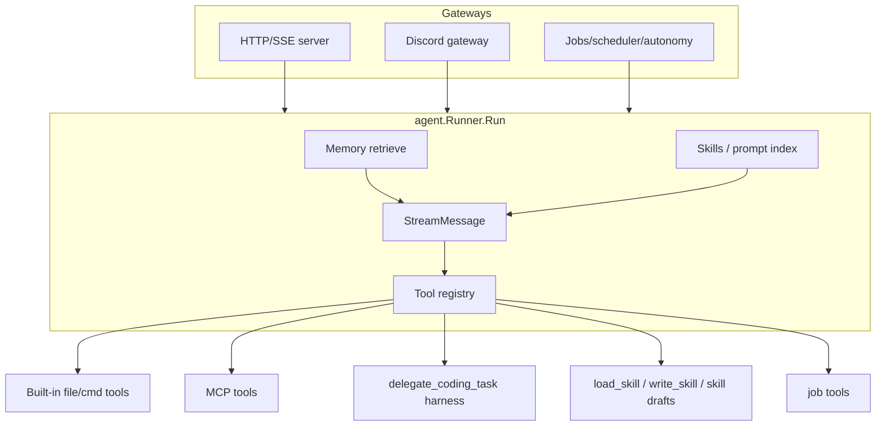

# 06 — cometmind Features

> **Prerequisite:** [05-cometmind-runtime.md](./05-cometmind-runtime.md)  
> **Next:** [07-cometline-desktop.md](./07-cometline-desktop.md)

These features are built on the core runtime in [05-cometmind-runtime.md](./05-cometmind-runtime.md). Each one connects to the agent loop, to settings, or to the gateway. None of them break the streaming contract.

A **streaming contract** is the rule for events sent while a reply is still running. A **gateway** receives messages from another app. A **turn** is one user message plus the work to answer it.

---

## Semantic memory

**Semantic memory** stores facts by meaning, not only by exact words.

### What it does

- **Auto-retrieve.** Before each turn, relevant memories are added to the system prompt. **Relevant** means close in meaning to the current message.
- **Auto-extract.** After a conversation ends, new facts are saved.
- **Workspace-scoped.** Memories belong to the active project. A **workspace** is one project folder.
- **Compaction.** Stale entries can be merged or removed. **Stale** means old or no longer useful. You can run this from Settings → Memory. It can also run automatically after extraction.

### Code map

| Component | File | Role |
|-----------|------|------|
| Service API | `internal/memory/service.go` | `RetrieveForTurn`, `Search`, and CRUD |
| Retriever | `internal/memory/retriever.go` | Embedding search, and top-k selection |
| Extractor | `internal/memory/extractor.go` | Fact extraction after a turn |
| Embeddings | `internal/memory/embedder.go` | Vector generation |
| Compactor | `internal/memory/compactor.go` | Memory compaction |
| DB | `internal/db/schema.sql` | `memories` table |

An **embedding** is a list of numbers that stands for text. A **vector** is that same list. **Top-k** means the k closest matches. **CRUD** means create, read, update, and delete.

GitNexus is the code index for this repository. Process `proc_198_search` follows `Service.Search` → `retriever.search` → `retriever.retrieve`.

### Flow

```text
Before turn:
  RetrieveForTurn(session, userMessage)
    → embed query
    → cosine search against workspace memories
    → format top-k into system prompt section
    → emit memory_injected

After turn:
  extractor analyzes user + assistant messages
  → create/update memory rows with embeddings
  → emit memory_updated
  → optional auto-compaction (CompactionOnExtract)
```

**Cosine search** ranks memories by how close their embeddings are. `CompactionOnExtract` is automatic compaction after extraction.

### Compaction

| Surface | Detail |
|---------|--------|
| Settings actions | Preview or run compaction from Settings → Memory |
| API | `POST /api/v1/memories/compaction-preview`, `POST /api/v1/memories/compaction-runs` |
| SSE | `memory_compaction_completed`. Often read from `GET /api/v1/events`. That path shows memory toasts. It is not only the chat reducer. |
| Live settings | `PUT /api/v1/memories/settings`, together with saving the JSON file |

**SSE** means Server-Sent Events. The server pushes events on one open connection. A **toast** is a short notice on screen. A **reducer** is code that applies events to UI state. An **API** is the HTTP interface other programs call.

Settings live in `cometmind.memory` inside `cometline-settings.json`. Renderer helpers are in `cometmind.ts`. The helpers are `defaultMemorySettings` and `resolveMemorySettings`. The **renderer** is the desktop page that shows the UI.

### Current memory lifecycle

Retrieved memories are classified for presentation. Examples are preference, semantic knowledge, and task outcome. They carry an effective weighting. They are not a list of equal facts.

**Presentation** means how a memory is labeled when it is used. **Effective weighting** means some memories count more than others.

Extraction runs after the visible turn. It is bounded across the runtime. **Bounded** means the runtime limits how much work can run at once. It may update or compact records in the background. The chat does not wait. That background work is **asynchronous**.

The chat reducer shows retrieval for the current turn. Runtime SSE at layout level handles background updates and compaction feedback. **Layout level** means the app shell, not only the chat view.

---

## Agent Skills

### What they are

Skills are reusable prompt templates. Each skill is a `SKILL.md` file. The file starts with YAML frontmatter. **YAML** is a text format for small structured fields. **Frontmatter** is the header block at the top. It includes `name` and `description`.

### Discovery paths

1. `~/.cometmind/skills/{name}/SKILL.md`. These are global skills.
2. `{workspace}/.agents/skills/{name}/SKILL.md`. These are workspace skills.
3. `{workspace}/.claude/skills/{name}/SKILL.md`. These follow the Claude style.
4. Optional OpenCode or Claude Code skill roots. These paths are set in settings.

**Global** means available in every workspace.

### Invocation

**Invocation** means how a skill is started.

- In chat, type `/{skill-name}` in the composer. The **composer** is the box where you type.
- Built-in slash commands live in `cometline/src/lib/skills/slash-commands.ts`:
  - `/change` forks this session into another workspace. A **fork** is a new session started from this one.
  - `/clear` clears the transcript and starts fresh. The session title stays. A **transcript** is the saved chat text.
  - `/create-skill` drafts a skill for review.
  - `/model` switches the model for the current session.
  - `/job` claims a ready job.
  - `/list-jobs` lists ready jobs.
- On Discord, the same slash syntax works when the bot is mentioned.

### Code map

| Component | File |
|-----------|------|
| Registry | `internal/skills/skills.go`. Methods: `Find`, `SkillMarkdown` |
| Tools | `load_skill`, `read_skill_file`, `write_skill`, and draft skill tools in the tools registry |
| API | Routes for listing, deletion, export, sync, and draft review |
| Drafts | `internal/skills/drafts.go`, `/api/v1/skill-drafts/*` |
| Frontend filter | `slash-commands.ts`, with relevance scoring |

**Relevance scoring** ranks matches. A closer name match ranks higher.

Agent tools and `cometmind skills show` load skill content. HTTP routes manage listing, export, deletion, sync, and drafts.

Generated skills can be written as drafts under `~/.cometmind/skill-drafts/`. Review them in Cometline at `/skill-drafts`. Then promote a draft into `~/.cometmind/skills/{name}/SKILL.md`. **Promote** means move the draft into the real skills folder.

---

## MCP client

### What it does

CometMind connects to outside Model Context Protocol servers. It gives their tools to the main agent only. That surface is `ParentSurface`. A **surface** is the set of actions an agent may take. Coding-harness child processes do not get MCP tools. Coding subagents do not get them either.

A **subagent** is a smaller agent started by the main agent. A **harness** is an outside coding program.

### Configuration

Open Settings, then CometMind, then MCP. The data is stored in `cometmind.mcp` inside `cometline-settings.json`. You can import a Cursor-style `mcp.json`.

### Transports

A **transport** is the connection type.

| Transport | Use case |
|-----------|----------|
| `stdio` | Local subprocess servers |
| `http` | Streamable HTTP. Recommended for OAuth. |
| `sse` | Older SSE transport |

A **subprocess** is a program started by CometMind.

### Tool naming

Tools are registered as `mcp_{serverId}_{toolName}`. Characters that are not allowed become `_`.

### OAuth (remote servers)

**OAuth** is a login flow. The user approves access in a browser. CometMind runs the full flow. The flow is spec-compliant. It follows the written OAuth specifications.

```text
Protected Resource Metadata (RFC 9728)
  → Authorization Server Metadata (RFC 8414)
  → Dynamic Client Registration (RFC 7591)
  → Authorization Code + PKCE
  → loopback callback http://localhost:1456/mcp/oauth/callback
```

**PKCE** is a check that the same app finishes the login it started. **Loopback** means the callback stays on this computer.

| Storage | Path |
|---------|------|
| Access and refresh token | `~/.cometmind/mcp-oauth/{serverId}.json` |
| Client identity and token endpoint | `~/.cometmind/mcp-oauth/{serverId}.client.json` |

At connect time, CometMind refreshes the token with no browser. This refresh is **headless**. The browser opens again only if refresh fails.

### Code map

| Component | File |
|-----------|------|
| Manager | `internal/mcp/manager.go` |
| Client connect | `internal/mcp/client.go`. Method: `connectServer` |
| OAuth refresh | `internal/mcp/oauth.go`. Method: `LoadOAuthToken` |
| OAuth flow | `internal/mcp/oauth_flow.go`, `oauth_login.go` |
| API | `/api/v1/mcp/servers`, `/tools`, connection-tests, oauth-flows |

GitNexus follows `StartOAuth` through the metadata discovery helpers in `oauth_flow.go`.

### Management API

| Endpoint | Purpose |
|----------|---------|
| `GET /api/v1/mcp/servers` | Connection status |
| `GET /api/v1/mcp/tools` | Tool preview |
| `POST .../connection-tests` | Test the connection |
| `POST .../reconnection-runs` | Reconnect the server |
| `POST .../oauth-flows` | Start OAuth |

---

## Coding task delegation (harness)

### What it does

The `delegate_coding_task` tool starts an outside coding harness. CometMind owns a fixed CLI profile for it. The profile is not interactive. The code is in `cometmind/internal/acp`.

**CLI** means the terminal command. **Not interactive** means the program does not ask questions while it runs.

The user only picks which harness to use. The command, arguments, and permission flags are not editable by the user.

Supported harnesses are `opencode`, `claude`, and `codex`.

In-process coding subagents are separate. They use native `CodingSurface` tools. They edit and run inside CometMind. They do not start a harness.

### User experience

```text
You: Refactor the auth module
Agent: I'll delegate this to OpenCode...
  [subagent_progress events stream in]
OpenCode: Done — refactored auth.go...
  [subagent_finished]
Agent: Here's a summary of what changed...
```

### Configuration

Open Settings, then CometMind, then **Coding task delegation**. The data is stored under `cometmind.acp` in `cometline-settings.json`:

```json
{
  "enabled": false,
  "default_harness": "opencode"
}
```

- `enabled` defaults to **false**. Native coding tools are preferred until the user turns the harness on.
- On migration, old user-supplied `command` and `args` fields are ignored. The harness commands are fixed in `acp/runner.go`:
  - OpenCode: `opencode run --format json --auto`
  - Claude Code: `claude -p --output-format stream-json --verbose --dangerously-skip-permissions`
  - Codex: `codex exec --json --dangerously-bypass-approvals-and-sandbox`

A **migration** here means reading an older settings file into the current shape.

### Code map

| Component | File |
|-----------|------|
| Harness runner | `internal/acp/runner.go`. `DefaultHarnessConfig`, `commandArgs` |
| Tool | `internal/tools/delegatecoding.go`. Registered only when ACP is enabled and the binary is available |
| SSE events | `subagent_started`, `subagent_progress`, `subagent_finished` in `event/event.go` |
| Frontend | `SubagentMessageRow.svelte`, `SubagentPanel.svelte`, and chat transcript helpers |
| Subagent runner | `runtime.SubagentRunnerFor` |

---

## Discord gateway

### What it does

The same agent runtime can run as a Discord bot. Each thread has its own session.

### Features

- Mention check, controlled by `require_mention`
- An allowlist of users and channels
- A saved session for each thread
- Slash commands and skill invocation
- The same memory and tool sandbox as the desktop app

An **allowlist** is the list of users or channels that may talk to the bot. A **sandbox** limits where tools may act.

### Code map

```text
cometmind/internal/gateway/
├── router.go          Router.HandleInbound → Runner.RunTurn
├── agent_runner.go    TurnRunner interface
└── discord/
    ├── adapter.go     Discord event adapter
    ├── messages.go    Message handling
    ├── commands.go    Slash commands
    └── job_proposal.go
```

Start with `cometmind gateway run --platform discord`. Set the `DISCORD_BOT_TOKEN` environment variable. An **environment variable** is a value set outside the program.

Config is in the `cometmind.gateway.discord` section of the settings JSON.

---

## Jobs, scheduler, and autonomy

CometMind has a durable work queue. **Durable** means the jobs stay after the process exits. These tasks last longer than one chat turn.

### Job lifecycle

Jobs move through `todo`, `ongoing`, `done`, and `blocked`. A worker claims a lease. A **lease** means that worker owns the job for a limited time. It sends a heartbeat while it owns the job. A **heartbeat** is a regular signal that the work is still running. The worker then completes, releases, blocks, archives, or deletes the job. Every status change writes a `job_events` row.

### Scheduled jobs

A scheduled job is a definition, not the running job itself. It has either a one-shot `run_at` or a repeating `cron_expr`. **One-shot** means it runs once. **Cron** is a text rule for a repeating time. `scheduler.MaterializeDue` creates ordinary jobs from due schedules. Execution then uses the same lease and completion path.

**Due** means the scheduled time has arrived. **Materialize** means create the real job row.

### Autonomous worker

When this is enabled, `internal/autonomy` polls for ready jobs. It runs them in bounded agent sessions. Each session uses the configured provider, model, and max steps.

**Poll** means check again on a timer. A **provider** is the code that talks to one model service.

| Component | File |
|-----------|------|
| Jobs service | `internal/jobs/` |
| Scheduler | `internal/scheduler/` |
| Autonomous worker | `internal/autonomy/` |
| API | `/api/v1/jobs`, `/api/v1/scheduled-jobs` |
| Desktop UI | `cometline/src/lib/components/jobs/`, `/jobs` route |
| Retention | `internal/retention/retention.go`. `Runner.Run` deletes old data. `serve` and the Discord gateway start periodic maintenance. |
| Progress hook | `internal/agent/job_progress_hook.go`. It sends progress during agent runs. |

**Retention** is the rule for deleting old data. **Periodic** means it runs on a timer.

Settings are `cometmind.jobs`, `cometmind.autonomy`, `cometmind.scheduler`, and `cometmind.storage`. The jobs reconcile interval, autonomy, and most related settings apply through in-place `Runtime.Reload`. A full sidecar restart is not required.

**Reconcile** means the jobs worker checks the queue on its interval. **In place** means the running process reloads settings and does not exit. A **sidecar** is the CometMind process started by the desktop app.

---

## Context compaction

When a chat gets long, CometMind can shorten the old part of the transcript. This is **context compaction**. It is not the same as memory compaction above.

The **context window** is the total space for the prompt plus the reply. A **token** is a small piece of text that the model counts.

The app first reserves space for the reply. The reserve is the larger of the step output limit and 20,000 tokens. The step output limit is `min(current model output limit, 32,000)`. The rest of the context window can hold the prompt. If the prompt is still too big, compaction runs.

| Component | File |
|-----------|------|
| Agent compaction | `internal/agent/compaction.go` |
| Session helpers | `internal/session/compaction.go` |

This runs during the agent turn when context passes the configured budget thresholds. The `turn_status` phase is `compacting_context`. A **threshold** is a limit. Crossing it starts the action.

---

## Assistant media and screen capture

The runtime can send an `assistant_image` SSE event after it saves image media. While the session exists, chat loads the bytes from `GET /api/v1/sessions/{id}/media/{mediaId}`.

The gallery is at `/gallery`. It lists ready catalog rows with `GET /api/v1/media`. It loads bytes from `GET /api/v1/media/{id}/content`. A **catalog row** is the database record for one media file.

Deleting a session does not remove gallery files. Clearing a transcript does not remove them. Retention does not remove them. Deleting an empty workspace does not remove them. Those paths set `session_id` and `workspace_id` to null. The files stay in `~/.cometmind/media/{storage_session_id}/`.

The gallery shows a warning when the original session is gone. Only `DELETE /api/v1/media/{id}` tombstones the row and deletes the file. A **tombstone** marks the row as deleted.

For live captures, CometMind talks to a loopback capture bridge owned by Electron. Electron checks the OS screen-recording permission. It lists capture targets. It also limits image size and cropping.

A screenshot does not give the agent open access to the renderer or to Node. **Node** is the JavaScript runtime that can read files and start processes.

---

## Agent-editable settings tools

The parent surface has `list_settings`, `get_settings`, and `patch_settings`. They read and write `cometline-settings.json`. API keys are redacted. **Redacted** means the secret is hidden in the tool output.

They automatically apply a reload, or a gateway recycle, through `settingsapply.Classify`. **Recycle** means stop that process and start it again. They reject desktop-only keys. Those keys are `appearance`, `shortcuts`, and `app`. They belong in `cometline-desktop.json`.

---

## Prompt index

Skills, memories, and system prompts are assembled through a prompt index. GitNexus names the paths `RunChat → PromptIndex` and `JobPromptIndex`.

The index chooses what enters the system prompt on each turn. That includes the SOUL persona, workspace context, retrieved memories, and loaded skills.

A **persona** is the written character of the assistant. SOUL is that text.

---

## Feature interaction diagram

The diagram shows how these features connect to `agent.Runner.Run`.



---

## What's next

[07-cometline-desktop.md](./07-cometline-desktop.md) explains how Electron starts CometMind. It also explains how Electron connects native OS features to the renderer.
