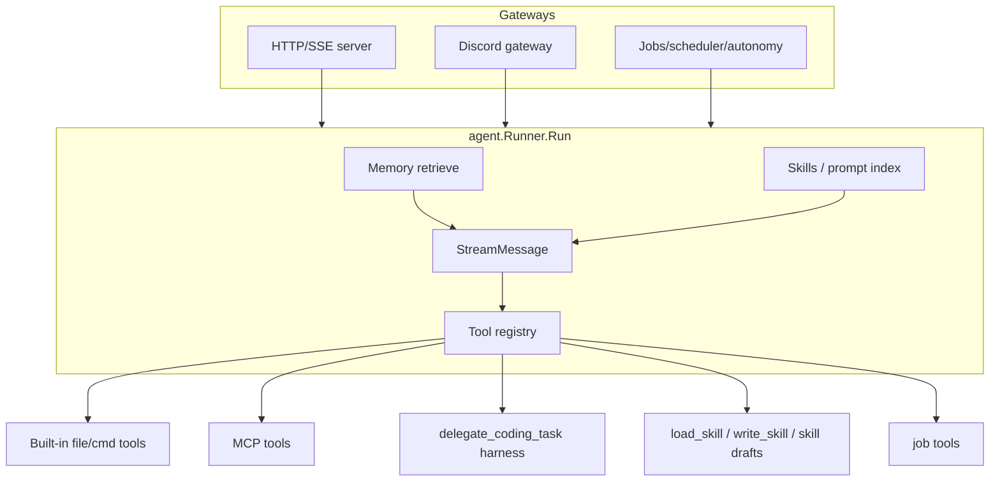

# 06 — cometmind Features

> **Prerequisite:** [05-cometmind-runtime.md](./05-cometmind-runtime.md)  
> **Next:** [07-cometline-desktop.md](./07-cometline-desktop.md)

Extensions built on the core runtime from [05-cometmind-runtime.md](./05-cometmind-runtime.md). Each feature hooks into the agent loop, settings, or gateway layer without breaking the streaming contract.

---

## Semantic memory

### What it does

- **Auto-retrieve** — relevant memories injected into the system prompt before each turn
- **Auto-extract** — new facts captured after conversations complete
- **Workspace-scoped** — memories belong to the active project
- **Compaction** — merge/prune stale entries (manual from Settings → Memory, or automatic on extract)

### Code map

| Component | File | Role |
|-----------|------|------|
| Service API | `internal/memory/service.go` | `RetrieveForTurn`, `Search`, CRUD |
| Retriever | `internal/memory/retriever.go` | Embedding search, top-k selection |
| Extractor | `internal/memory/extractor.go` | Post-turn fact extraction |
| Embeddings | `internal/memory/embedder.go` | Vector generation |
| Compactor | `internal/memory/compactor.go` | Memory compaction |
| DB | `internal/db/schema.sql` | `memories` table |

GitNexus process `proc_198_search` traces: `Service.Search` → `retriever.search` → `retriever.retrieve`.

### Flow

```text
Before turn:
  RetrieveForTurn(session, userMessage)
    → embed query
    → cosine search against workspace memories
    → format top-k into system prompt section
    → emit memory_injected

After turn:
  extractor analyzes user + assistant messages
  → create/update memory rows with embeddings
  → emit memory_updated
  → optional auto-compaction (CompactionOnExtract)
```

### Compaction

| Surface | Detail |
|---------|--------|
| Settings actions | Preview / run compaction from Settings → Memory |
| API | `POST /api/v1/memories/compaction-preview`, `POST /api/v1/memories/compaction-runs` |
| SSE | `memory_compaction_completed` (often consumed via `GET /api/v1/events` → memory toasts, not only the chat reducer) |
| Live settings | `PUT /api/v1/memories/settings` alongside JSON persistence |

Settings: `cometmind.memory` in `cometline-settings.json`. Renderer helpers in `cometmind.ts` (`defaultMemorySettings`, `resolveMemorySettings`).

### Current memory lifecycle

Retrieved memories are classified for presentation (for example preference, semantic knowledge, and task outcome) and carry effective weighting rather than being a flat bag of facts. Extraction runs after the visible turn, is bounded across the runtime, and may update or compact records asynchronously. The chat reducer renders turn-scoped retrieval; layout-level runtime SSE handles background updates and compaction feedback.

---

## Agent Skills

### What they are

Reusable prompt templates stored as `SKILL.md` files with YAML frontmatter (`name`, `description`).

### Discovery paths

1. `~/.cometmind/skills/{name}/SKILL.md` — global
2. `{workspace}/.agents/skills/{name}/SKILL.md` — workspace
3. `{workspace}/.claude/skills/{name}/SKILL.md` — Claude-style
4. Optional OpenCode / Claude Code skill roots (configured in settings)

### Invocation

- Chat: `/{skill-name}` in the composer
- Built-in slash commands (in `cometline/src/lib/skills/slash-commands.ts`):
  - `/change` — fork session into another workspace
  - `/clear` — clear transcript and start fresh
  - `/create-skill` — draft a skill for review
  - `/model` — switch model for the current session
  - `/job` — claim a ready job
  - `/list-jobs` — list ready jobs
- Discord: same slash syntax when bot is mentioned

### Code map

| Component | File |
|-----------|------|
| Registry | `internal/skills/skills.go` — `Find`, `SkillMarkdown` |
| Tools | `load_skill`, `read_skill_file`, `write_skill`, draft skill tools in tools registry |
| API | `GET /api/v1/skills/{name}` etc. |
| Drafts | `internal/skills/drafts.go`, `/api/v1/skill-drafts/*` |
| Frontend filter | `slash-commands.ts` with relevance scoring |

GitNexus: `HandleGetSkill` → `Registry.Find` → `SkillMarkdown`.

Generated skills can be written as drafts under `~/.cometmind/skill-drafts/`, reviewed in Cometline's `/skill-drafts` route, then promoted into `~/.cometmind/skills/{name}/SKILL.md`.

---

## MCP client

### What it does

Connects to external Model Context Protocol servers and exposes their tools to the **main agent only** (ParentSurface). Coding-harness child processes and coding subagents do **not** receive MCP tools.

### Configuration

Settings → CometMind → MCP, persisted in `cometmind.mcp` inside `cometline-settings.json`. Can import Cursor-style `mcp.json`.

### Transports

| Transport | Use case |
|-----------|----------|
| `stdio` | Local subprocess servers |
| `http` | Streamable HTTP (recommended for OAuth) |
| `sse` | Legacy SSE transport |

### Tool naming

Registered as `mcp_{serverId}_{toolName}` (invalid chars become `_`).

### OAuth (remote servers)

Full spec-compliant flow driven by CometMind:

```text
Protected Resource Metadata (RFC 9728)
  → Authorization Server Metadata (RFC 8414)
  → Dynamic Client Registration (RFC 7591)
  → Authorization Code + PKCE
  → loopback callback http://localhost:1456/mcp/oauth/callback
```

| Storage | Path |
|---------|------|
| Access/refresh token | `~/.cometmind/mcp-oauth/{serverId}.json` |
| Client identity + token endpoint | `~/.cometmind/mcp-oauth/{serverId}.client.json` |

Headless token refresh at connect time; browser re-auth only if refresh fails.

### Code map

| Component | File |
|-----------|------|
| Manager | `internal/mcp/manager.go` |
| Client connect | `internal/mcp/client.go` — `connectServer` |
| OAuth refresh | `internal/mcp/oauth.go` — `LoadOAuthToken` |
| OAuth flow | `internal/mcp/oauth_flow.go`, `oauth_login.go` |
| API | `/api/v1/mcp/servers`, `/tools`, connection-tests, oauth-flows |

GitNexus traces `StartOAuth` through metadata discovery helpers in `oauth_flow.go`.

### Management API

| Endpoint | Purpose |
|----------|---------|
| `GET /api/v1/mcp/servers` | Connection status |
| `GET /api/v1/mcp/tools` | Tool preview |
| `POST .../connection-tests` | Test connection |
| `POST .../reconnection-runs` | Reconnect server |
| `POST .../oauth-flows` | Start OAuth |

---

## Coding task delegation (harness)

### What it does

The `delegate_coding_task` tool spawns an **external coding harness** through a fixed, non-interactive CLI profile owned by CometMind (`cometmind/internal/acp`). Users only pick which harness to use — command, arguments, and permission flags are **not** user-editable.

Supported harnesses: `opencode`, `claude`, `codex`.

In-process coding subagents (native `CodingSurface` tools) are separate: they edit/run inside CometMind without spawning a harness.

### User experience

```text
You: Refactor the auth module
Agent: I'll delegate this to OpenCode...
  [subagent_progress events stream in]
OpenCode: Done — refactored auth.go...
  [subagent_finished]
Agent: Here's a summary of what changed...
```

### Configuration

Settings → CometMind → **Coding task delegation**, persisted under `cometmind.acp` in `cometline-settings.json`:

```json
{
  "enabled": false,
  "default_harness": "opencode"
}
```

- `enabled` defaults to **false** (native coding tools are preferred until the user opts in).
- Legacy user-supplied `command` / `args` fields are ignored on migration; harness CLIs are fixed in `acp/runner.go`:
  - OpenCode: `opencode run --format json --auto`
  - Claude Code: `claude -p --output-format stream-json --verbose --dangerously-skip-permissions`
  - Codex: `codex exec --json --dangerously-bypass-approvals-and-sandbox`

### Code map

| Component | File |
|-----------|------|
| Harness runner | `internal/acp/runner.go` — `DefaultHarnessConfig`, `commandArgs` |
| Tool | `internal/tools/delegatecoding.go` (registered only when ACP enabled + binary available) |
| SSE events | `subagent_started`, `subagent_progress`, `subagent_finished` in `event/event.go` |
| Frontend | `SubagentMessageRow.svelte`, `SubagentPanel.svelte`, chat transcript helpers |
| Subagent runner | `runtime.SubagentRunnerFor` |

---

## Discord gateway

### What it does

Runs the same agent runtime as a Discord bot with per-thread sessions.

### Features

- @mention gating (`require_mention`)
- Allowlisted users and channels
- Per-thread persistent sessions
- Slash commands and skill invocation
- Same memory and tool sandbox as desktop

### Code map

```text
cometmind/internal/gateway/
├── router.go          Router.HandleInbound → Runner.RunTurn
├── agent_runner.go    TurnRunner interface
└── discord/
    ├── adapter.go     Discord event adapter
    ├── messages.go    Message handling
    ├── commands.go    Slash commands
    └── job_proposal.go
```

Start: `cometmind gateway run --platform discord` with `DISCORD_BOT_TOKEN` env var.

Config in `cometmind.gateway.discord` section of settings JSON.

---

## Jobs, scheduler, and autonomy

CometMind has a durable work queue for tasks that outlive a single chat turn.

### Job lifecycle

Jobs move through `todo`, `ongoing`, `done`, and `blocked`. A worker claims a lease, heartbeats while it owns the job, then completes, releases, blocks, archives, or deletes it. Every lifecycle change records a `job_events` row.

### Scheduled jobs

Scheduled jobs are definitions with either a one-shot `run_at` or recurring `cron_expr`. `scheduler.MaterializeDue` creates ordinary jobs, so execution reuses the same lease/completion path.

### Autonomous worker

When enabled, `internal/autonomy` polls for ready jobs and runs them through bounded agent sessions with configured provider/model and max steps.

| Component | File |
|-----------|------|
| Jobs service | `internal/jobs/` |
| Scheduler | `internal/scheduler/` |
| Autonomous worker | `internal/autonomy/` |
| API | `/api/v1/jobs`, `/api/v1/scheduled-jobs` |
| Desktop UI | `cometline/src/lib/components/jobs/`, `/jobs` route |
| Retention | `internal/retention/retention.go` — `Runner.Run` prunes old data |
| Progress hook | `internal/agent/job_progress_hook.go` — emits progress during agent runs |

Settings: `cometmind.jobs`, `cometmind.autonomy`, `cometmind.scheduler`, and `cometmind.storage`. Jobs reconcile interval, autonomy, and most related knobs apply via in-place `Runtime.Reload` — no full sidecar restart.

---

## Context compaction

When conversations grow long, CometMind can compact the **session transcript** to stay within model limits (separate from **memory** compaction above).

| Component | File |
|-----------|------|
| Agent compaction | `internal/agent/compaction.go` |
| Session helpers | `internal/session/compaction.go` |

Triggered during the agent turn path when context exceeds configured budget thresholds (`turn_status` phase `compacting_context`).

---

## Assistant media and screen capture

The runtime can emit an `assistant_image` SSE event after persisting image media. The renderer fetches it through `GET /api/v1/sessions/{id}/media/{imageId}` and displays it with a lightbox. For live captures, CometMind talks to the Electron-owned loopback capture bridge; Electron enforces OS screen-recording permission, enumerates capture targets, and bounds image size/cropping. The agent never receives arbitrary renderer or Node access just because a screenshot exists.

---

## Agent-editable settings tools

Parent-surface tools `list_settings`, `get_settings`, and `patch_settings` read/write `cometline-settings.json` (API keys redacted). They auto-apply reload or gateway recycle via `settingsapply.Classify`, and **reject** desktop-only keys (`appearance`, `shortcuts`, `app`) that belong in `cometline-desktop.json`.

---

## Prompt index

Skills, memories, and system prompts are assembled through a prompt index layer (GitNexus: `RunChat → PromptIndex`, `JobPromptIndex`).

This centralizes what gets injected into the system prompt each turn — SOUL persona, workspace context, retrieved memories, loaded skills.

---

## Feature interaction diagram



---

## What's next

[07-cometline-desktop.md](./07-cometline-desktop.md) — how Electron spawns CometMind and bridges native OS features to the renderer.
