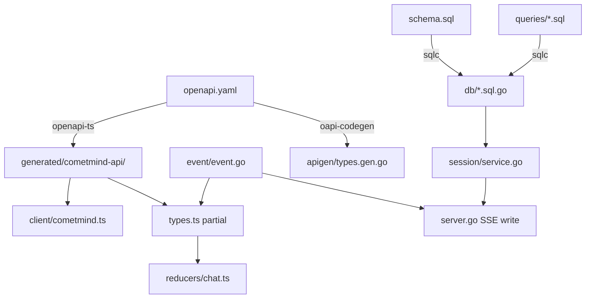

# 09 — Contracts and Generated Code

> **Prerequisite:** [08-cometline-frontend.md](./08-cometline-frontend.md)  
> **Next:** [10-development-guide.md](./10-development-guide.md)

## Why contracts matter

Cometline spans three modules in one repo. The **contracts** between them are the load-bearing walls — change one without updating the others and you get type errors, silent UI bugs, or broken persistence.

This doc maps every source-of-truth definition to its generated consumers.

## Contract map

```text
cometmind/openapi.yaml          → TS client + Go types
cometmind/internal/db/schema.sql → sqlc Go queries
cometmind/internal/event/event.go → SSE wire format (mirrored in openapi.yaml)
cometline/src/lib/settings/schema.ts → generated JSON schema for Electron validation
```

**Rule:** Edit sources of truth, run codegen, never hand-edit generated files.

---

## OpenAPI contract

### Source

`cometmind/openapi.yaml` — authoritative REST/SSE API description.

### Generated outputs

| Output            | Generator             | Path                                         |
| ----------------- | --------------------- | -------------------------------------------- |
| TypeScript client | `@hey-api/openapi-ts` | `cometline/src/lib/generated/cometmind-api/` |
| Go types          | `oapi-codegen`        | `cometmind/internal/apigen/types.gen.go`     |

### Regenerate

```bash
# From repo root
make generate

# Or individually
cd cometline && pnpm run generate:api
cd cometmind && go generate ./internal/apigen
```

### When to update

- Adding/removing/changing API endpoints
- Changing request/response schemas
- Adding new `StreamEvent` types

### Checklist for API changes

1. Edit `openapi.yaml`
2. Implement handler in `server/` (e.g. `messages.go`, feature-specific files) and register in `server.go`
3. `make generate`
4. Update `cometline/src/lib/client/cometmind.ts` if hand-written paths change
5. Update reducer in `reducers/chat.ts` and/or runtime consumers (`memory-toasts`, layout) if SSE types change
6. Add/update tests in `cometmind/internal/contract/contract_test.go`

---

## SSE event contract

SSE events are JSON objects with a `type` discriminator. They appear in both OpenAPI (`StreamEvent` schema) and Go code.

### Full event catalog

**Turn rendering:** `text_delta`, `reasoning_start`, `reasoning_delta`, `tool_call`, `tool_result`, `step_finish`, `turn_status`, `turn_recover`, `error`, `done`

**Delegation:** `subagent_started`, `subagent_progress`, `subagent_finished`

**Context and memory:** `context_budget`, `memory_injected`, `memory_updated`, `memory_compaction_completed`

**Runtime notifications:** `inbox_message_created`, `inbox_message_archived`

**Media:** `assistant_image`

### Consumer matrix

| Consumer                                                    | Events                                                |
| ----------------------------------------------------------- | ----------------------------------------------------- |
| Chat reducer (`reducers/chat.ts`)                           | Session-turn rendering, including `turn_recover` and context budget |
| Transcript UI (`MessageContextChips`, image bubble/lightbox) | Persisted message-context references and `assistant_image` media |
| Runtime SSE (`GET /api/v1/events` → layout / memory toasts) | Background memory lifecycle and inbox-created/archived notifications |

### Go source of truth

`cometmind/internal/event/event.go` — event structs + emitter helpers (`TextDelta`, `ToolCall`, `Done`, etc.)

### TypeScript mirror

`cometline/src/lib/types.ts` — `StreamEvent` union type

### Adding a new SSE event

1. Extend `StreamEvent` in `openapi.yaml`
2. Add struct + emitter in `event/event.go`
3. `make generate`
4. Add case in `reducers/chat.ts` **and/or** runtime toast/layout consumer (not every event is a chat row — e.g. compaction)
5. Add UI rendering if needed (component or ChatItem variant)
6. Extend `contract_test.go`

---

## Database contract (sqlc)

### Sources

| File                        | Role                              |
| --------------------------- | --------------------------------- |
| `internal/db/schema.sql`    | Table definitions                 |
| `internal/db/queries/*.sql` | SQL queries with named parameters |

### Generated (do not edit)

| File                    | Contents      |
| ----------------------- | ------------- |
| `internal/db/*.sql.go`  | Query methods |
| `internal/db/db.go`     | DB wrapper    |
| `internal/db/models.go` | Row structs   |

### Regenerate

```bash
cd cometmind && sqlc generate
```

### Migrations

CometMind embeds `schema.sql` and tracks version in `internal/db/migrate.go`:

```go
schemaVersion = 26  // current at this documentation update; bump with each user-facing migration
alterStatements = []string{ ... }  // v(N-1) → vN
```

**Existing users need incremental migrations**, not just a schema.sql edit.

### Checklist for schema changes

1. Edit `schema.sql`
2. Add migration in `migrate.go` (`alterStatements`, bump `schemaVersion`)
3. Add/update queries in `queries/*.sql`
4. `sqlc generate`
5. Update `session/service.go` if domain logic changes
6. Update server handlers and tests

---

## Electron IPC contract

Not codegen-managed — manually kept in sync:

| Source                                | Mirror                                               |
| ------------------------------------- | ---------------------------------------------------- |
| `electron/src/shared/api.ts`          | TypeScript `ElectronAPI` interface                   |
| `electron/src/preload.ts`             | Exposed methods                                      |
| `electron/src/domains/runtime-ipc.ts` | Typed handler composition                            |
| `electron/src/domains/ipc.ts`         | `ipcMain.handle` / `ipcMain.on` channel registration |

When adding IPC methods, update the shared type, preload bridge, and matching handler/domain registration.

---

## Settings schema

`cometline/src/lib/settings/schema.ts` — Zod validation and normalization for the merged settings shape the UI edits.

On disk Electron splits:

- `~/.cometmind/cometline-settings.json` — runtime (providers, `cometmind.*`)
- `~/.cometmind/cometline-desktop.json` — `appearance`, `shortcuts`, `app`

`electron/src/domains/settings.ts` imports the hand-maintained TypeScript schema directly for Electron save-time validation and normalization. `electron/src/domains/settings-domain.ts` owns the split/merge helpers and atomic disk writes; no separate settings-schema artifact is generated.

Reload vs gateway recycle vs full restart is classified by `cometmind/internal/settingsapply` (and mirrored Electron helpers). Prefer reload; full restart is mainly for host/port.

The TypeScript schema and Electron settings domains are hand-maintained. Update them together when adding settings fields, especially fields that affect reload/restart behavior. See [../SETTINGS_AND_PERSISTENCE.md](../SETTINGS_AND_PERSISTENCE.md).

---

## Codegen freshness check

```bash
make check   # includes codegen freshness verification
```

CI fails if generated files drift from sources. Always run `make generate` before committing contract changes.

---

## Contract dependency diagram



---

## Version skew risks

| Scenario                                                             | Symptom                                     | Fix                                                                                                                           |
| -------------------------------------------------------------------- | ------------------------------------------- | ----------------------------------------------------------------------------------------------------------------------------- |
| openapi.yaml changed, TS not regenerated                             | Type errors in client                       | `make generate`                                                                                                               |
| schema.sql changed, sqlc not run                                     | Compile errors in session                   | `sqlc generate`                                                                                                               |
| New SSE event in Go only                                             | Reducer ignores events                      | Add reducer case + TS type                                                                                                    |
| Migration missing                                                    | Existing users' DB breaks                   | Add `alterStatements`                                                                                                         |
| Settings schema changed but Electron settings domain was not updated | Electron persistence/normalization diverges | Update `src/lib/settings/schema.ts` and the relevant `electron/src/domains/{settings,settings-domain,runtime-ipc}.ts` modules |
| Hand-edited generated file                                           | Next generate overwrites                    | Edit source only                                                                                                              |

---

## What's next

[10-development-guide.md](./10-development-guide.md) — practical commands, extension recipes, and verification workflow.
