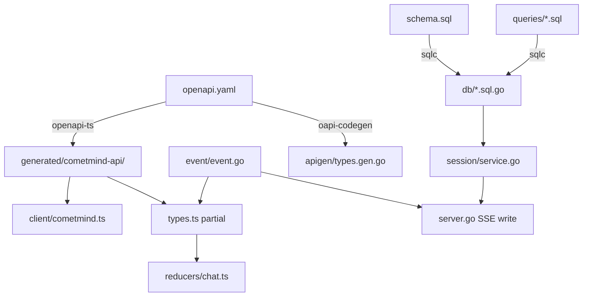

# 09 - Contracts and Generated Code

> **Prerequisite:** [08-cometline-frontend.md](./08-cometline-frontend.md)  
> **Next:** [10-development-guide.md](./10-development-guide.md)

## Why contracts matter

Cometline has three modules in one repo. A **contract** is a shared definition that both sides must follow. If you change one side and not the others, you get type errors. You can also get UI bugs that show no error. Saved data can break too.

This doc maps each source of truth to the files generated from it. A source of truth is the file you edit. The generated file is a copy. Do not edit that copy by hand.

## Contract map

```text
cometmind/openapi.yaml          → TS client + Go types
cometmind/internal/db/schema.sql → sqlc Go queries
cometmind/internal/event/event.go → SSE wire format (mirrored in openapi.yaml)
cometline/src/lib/settings/schema.ts → generated JSON schema for Electron validation
```

**Rule:** Edit the source of truth. Run code generation. Never edit a generated file by hand.

---

## OpenAPI contract

### Source

`cometmind/openapi.yaml` is the authoritative REST and SSE API description. Authoritative means this file is the one to follow if another copy disagrees. **OpenAPI** is a file format that describes an HTTP API. **REST** is a request-and-response web API. **SSE** means Server-Sent Events: a live stream of events from the server.

### Generated outputs

| Output            | Generator             | Path                                         |
| ----------------- | --------------------- | -------------------------------------------- |
| TypeScript client | `@hey-api/openapi-ts` | `cometline/src/lib/generated/cometmind-api/` |
| Go types          | `oapi-codegen`        | `cometmind/internal/apigen/types.gen.go`     |

### Regenerate

```bash
# From repo root
make generate

# Or individually
cd cometline && pnpm run generate:api
cd cometmind && go generate ./internal/apigen
```

### When to update

- Adding, removing, or changing API endpoints
- Changing request or response schemas
- Adding a new `StreamEvent` type

A schema is the shape of the data. An endpoint is one API path.

### Checklist for API changes

1. Edit `openapi.yaml`.
2. Implement the handler in `server/`, for example `messages.go` or a feature file. Register it in `server.go`.
3. Run `make generate`.
4. Update `cometline/src/lib/client/cometmind.ts` if a hand-written path changes.
5. If SSE types change, update `reducers/chat.ts`, a runtime consumer, or both. Runtime consumers include `memory-toasts` and the layout.
6. Add or update tests in `cometmind/internal/contract/contract_test.go`.

---

## SSE event contract

SSE events are JSON objects with a `type` field. That field is the discriminator. A discriminator says which kind of object this is. The same events appear in the OpenAPI `StreamEvent` schema and in the Go code.

### Full event catalog

**Turn rendering:** `text_delta`, `reasoning_start`, `reasoning_delta`, `tool_call`, `tool_result`, `step_finish`, `turn_status`, `turn_recover`, `error`, `done`

**Delegation:** `subagent_started`, `subagent_progress`, `subagent_finished`

**Context and memory:** `context_budget`, `memory_injected`, `memory_updated`, `memory_compaction_completed`

**Runtime notifications:** `inbox_message_created`, `inbox_message_archived`

**Media:** `assistant_image`

### Consumer matrix

| Consumer                                                    | Events                                                |
| ----------------------------------------------------------- | ----------------------------------------------------- |
| Chat reducer (`reducers/chat.ts`)                           | Session-turn rendering, including `turn_recover` and context budget |
| Transcript UI (`MessageContextChips`, image bubble/lightbox) | Persisted message-context references and `assistant_image` media |
| Runtime SSE (`GET /api/v1/events` → layout / memory toasts) | Background memory lifecycle and inbox-created/archived notifications |

A reducer turns events into UI state. A bubble is one message block in the chat. A lightbox is a large image view over the page. Persisted means saved. Lifecycle means how that data is created, updated, and finished.

### Go source of truth

`cometmind/internal/event/event.go` holds the event structs and the emitter helpers. Examples are `TextDelta`, `ToolCall`, and `Done`. An emitter is a function that sends one event.

### TypeScript mirror

`cometline/src/lib/types.ts` holds the `StreamEvent` union type. A union type can be one of several shapes. A mirror is a matching copy of the same shapes.

### Adding a new SSE event

1. Extend `StreamEvent` in `openapi.yaml`.
2. Add a struct and an emitter in `event/event.go`.
3. Run `make generate`.
4. Add a case in `reducers/chat.ts`, in the runtime toast or layout consumer, or in both. Not every event is a chat row. Compaction is one example. Compaction means making stored memory shorter.
5. Add UI rendering if it is needed. That can be a component or a `ChatItem` variant.
6. Extend `contract_test.go`.

---

## Database contract (sqlc)

### Sources

| File                        | Role                              |
| --------------------------- | --------------------------------- |
| `internal/db/schema.sql`    | Table definitions                 |
| `internal/db/queries/*.sql` | SQL queries with named parameters |

`sqlc` generates Go code from these SQL files.

### Generated (do not edit)

| File                    | Contents      |
| ----------------------- | ------------- |
| `internal/db/*.sql.go`  | Query methods |
| `internal/db/db.go`     | DB wrapper    |
| `internal/db/models.go` | Row structs   |

A wrapper here is a Go layer around the database.

### Regenerate

```bash
cd cometmind && sqlc generate
```

### Migrations

CometMind embeds `schema.sql` and tracks the version in `internal/db/migrate.go`. Embed means the file is built into the program.

```go
schemaVersion = ... // read the current value in migrate.go; bump with each user-facing migration
alterStatements = []string{ ... }  // v(N-1) → vN
```

Bump means increase the version number. User-facing means the change affects people who already use the app. Each entry moves the database from the previous version to the next.

Users who already have a database need an incremental migration. Editing `schema.sql` alone is not enough. Incremental means one small step from the old version to the new one. Each version saves `user_version`. That saved number is a checkpoint. A table rebuild that runs `DROP TABLE` must stay in one transaction. A transaction is a group of database changes that succeed or fail together.

### Checklist for schema changes

1. Edit `schema.sql`.
2. Add a migration in `migrate.go`. Add it to `alterStatements`, and increase `schemaVersion`.
3. Add or update queries in `queries/*.sql`.
4. Run `sqlc generate`.
5. Update `session/service.go` if domain logic changes.
6. Update server handlers and tests.

---

## Electron IPC contract

This contract is not generated. You keep the copies matched by hand. **IPC** means Inter-Process Communication: messages between the Electron processes.

| Source                                | Mirror                                               |
| ------------------------------------- | ---------------------------------------------------- |
| `electron/src/shared/api.ts`          | TypeScript `ElectronAPI` interface                   |
| `electron/src/preload.ts`             | Exposed methods                                      |
| `electron/src/domains/runtime-ipc.ts` | Typed handler composition                            |
| `electron/src/domains/ipc.ts`         | `ipcMain.handle` / `ipcMain.on` channel registration |

When you add an IPC method, update three places. Update the shared type. Update the preload bridge. Update the matching handler or domain registration. A bridge is the preload layer the screen is allowed to call.

---

## Settings schema

`cometline/src/lib/settings/schema.ts` uses Zod to check the merged settings shape. It also normalizes that shape. Zod is a library that checks data shapes. Normalize means it rewrites values into the expected form. The UI edits this merged shape.

On disk, Electron splits the files:

- `~/.cometmind/cometline-settings.json` holds runtime settings. That includes providers and `cometmind.*`.
- `~/.cometmind/cometline-desktop.json` holds `appearance`, `shortcuts`, and `app`.

`electron/src/domains/settings.ts` imports the TypeScript schema that people maintain by hand. Electron uses it to check and normalize values on save. `electron/src/domains/settings-domain.ts` owns the split and merge helpers. It also owns atomic disk writes. Atomic means the write finishes fully, or the old file stays. No separate settings-schema file is generated.

`cometmind/internal/settingsapply` chooses the apply mode. Electron helpers mirror that choice. The modes are reload, gateway recycle, and full restart. Prefer reload. A full restart is mainly for host or port changes. Recycle means stop that process and start it again.

The TypeScript schema and the Electron settings domains are maintained by hand. Update them together when you add a settings field. This matters most when the field changes reload or restart behavior. See [../SETTINGS_AND_PERSISTENCE.md](../SETTINGS_AND_PERSISTENCE.md).

---

## Codegen freshness check

```bash
make check   # includes codegen freshness verification
```

Codegen means code generation. Freshness means the generated files still match their sources. CI fails if those files no longer match. CI is the automated check that runs on a proposed change. Always run `make generate` before you commit a contract change.

---

## Contract dependency diagram



---

## Version skew risks

Skew means the copies do not match.

| Scenario                                                             | Symptom                                     | Fix                                                                                                                           |
| -------------------------------------------------------------------- | ------------------------------------------- | ----------------------------------------------------------------------------------------------------------------------------- |
| `openapi.yaml` changed, but the TS client was not regenerated       | Type errors in the client                   | `make generate`                                                                                                               |
| `schema.sql` changed, but sqlc was not run                          | Compile errors in session                   | `sqlc generate`                                                                                                               |
| New SSE event exists in Go only                                     | The reducer ignores the events              | Add a reducer case and a TS type                                                                                              |
| The migration is missing                                            | The database breaks for existing users      | Add `alterStatements`                                                                                                         |
| The settings schema changed, but the Electron settings domain was not updated | Electron save and normalize behavior no longer matches | Update `src/lib/settings/schema.ts` and the relevant `electron/src/domains/{settings,settings-domain,runtime-ipc}.ts` modules |
| A generated file was edited by hand                                  | The next generate overwrites that edit      | Edit the source only                                                                                                          |

---

## What's next

[10-development-guide.md](./10-development-guide.md) covers practical commands, extension recipes, and the verification workflow. A recipe is a short step list for one kind of change. A workflow is the order of steps you follow.
